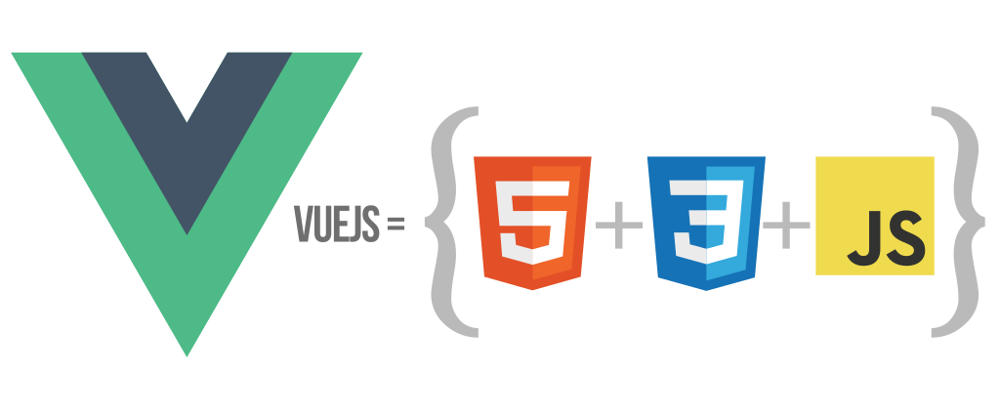

# Vue framework fundamentals
# ¿Qué es Vue?!

**Vue.js**  (_también llamado Vue o VueJS_) es un  **framework progresivo**  Javascript para crear interfaces de usuario, o en otras palabras, se trata de una «capa» añadida a Javascript formada por herramientas, convenciones de trabajo y un lenguaje particular que nos permite crear aplicaciones de forma rápida, agradable, sencilla y muy práctica.

> La palabra  **Vue**  (_pronunciado «viú»_) viene del francés y significa «view» (_vista_), que es como se le denomina a la parte visual del modelo MVC, parte en la que se centran estos frameworks.

**Vue**  es un framework frontend, es decir, que si vienes de framework del estilo de  **Laravel**  (_PHP_),  **Ruby on rails**  (_Ruby_),  **Spring**  (_Java_) u otros framework de backend, te encontrarás múltiples diferencias. En los últimos años se ha popularizado la creación de   (_Single Page Application_), que es la categoría donde se encuentra Vue, React, Angular, etc...

# ¿Por qué elegir Vue?

Quizás, la pregunta más frecuente cuando hablamos de  **frameworks de Javascript**  es  **¿Por qué Vue y no otro framework?**  ¿Por qué no elegir React? ¿o Angular? ¿o Svelte? ¿o cualquier otro framework Javascript? La respuesta a esta pregunta no es clara y es muy subjetiva.

> **Vue**  es un framework que tiene varias características que lo definen principalmente. Si tu proyecto o finalidad encaja con dichas características,  **Vue**  será una buena elección para ti. Sin embargo, si no se ajusta a dichas características, quizás sea mejor analizar otros frameworks.

Las características de  **Vue**  son las siguientes:

-   La  **curva de aprendizaje**  es, con diferencia, la más sencilla de los tres frameworks más populares: React, Vue y Angular.
    
-   Se trata de un  **framework**  muy amigable y respetuoso con las tecnologías de frontend y los estándares. Utiliza HTML, CSS y Javascript y es compatible con WebComponents (_de hecho, sus componentes se basan en ellos_). Si eres desarrollador con base fuerte de HTML/CSS, muy probablemente te guste más  **Vue**  que otras opciones.
    
-   Se trata de un  **framework progresivo**. Esto significa que es ideal para migrar y adaptar proyectos existentes hechos en otras tecnologías y pasarlos poco a poco a  **Vue**. Algo muy común cuando trabajas en proyectos  **legacy**  (_la mayoría de los casos_).
    
-   A los desarrolladores que provienen de lenguajes o frameworks exclusivamente de  **backend**  están acostumbrados a ciertos patrones de programación que no son exactamente iguales en  **frontend**. Es aconsejable aprender ciertas bases de frontend general. Una buena base de Javascript también es muy recomendable.
    
-   **Vue**  le da mayor protagonismo al enfoque tradicional «centrado en  **HTML**» así como a los sistemas de plantillas. Si te gustan,  **Vue**  probablemente te resulte muy atractivo. Por otro lado, el enfoque de  **React**  se suele centrar más en programación pura en Javascript, utilizando HTML y CSS sólo como complementos que se añaden a Javascript.

# Directivas de Vue

Las  **directivas de Vue**  son atributos especiales que se colocan en las etiquetas HTML y están prefijados por  `v-`, como por ejemplo,  `v-for`,  `v-bind`  o  `v-on`, entre muchas otras. Estas directivas permiten realizar  **acciones dinámicas potentes**  (_bucles, condicionales, etc..._) que no se pueden realizar en HTML por si solo, pero que  **Vue**  permite utilizar en sus etiquetas  `<template>`.

Dichas  **directivas**  están formadas por varias partes:

-   **Directiva**: El nombre de la directiva, que a veces, es posible abreviarlo con un carácter.
-   **Argumento**: En ciertas directivas se indica un parámetro.
-   **Modificador**: En ciertas directivas se puede modificar el comportamiento.
-   **Valor**: En ciertas directivas, se requiere establecer un valor. Se escribe como el valor de un atributo HTML.
Existen varias  **directivas en Vue**, las he dividido en varios grupos e iremos profundizando en ellas a lo largo de los siguientes capítulos y temas:

|  Tipos de directivas  | Directivas | Descripción|
|--|--|--|
| **Directivas básicas** | `v-pre`,  `v-once`,  `v-model`... |Permite realizar tareas simples.|
|**Directivas condicionales**|`v-show`,  `v-if`,  `v-else`...|Permiten realizar acciones según condiciones.
|**Directivas de bucles**|`v-for`|Permiten realizar operaciones varias veces.
|**Directivas avanzadas**|`v-bind`,  `v-on`,  `v-slot`|Permiten realizar tareas más específicas.
|**Directivas personalizadas**||Directivas propias definidas por el usuario.

## Directivas básicas
| Directiva vue | Valor | Descripción|
|--|--|--|
|`v-text`|**Sí**|Equivalente a  `{{ texto }}`. Usa  `.textContent`  internamente.
|`v-html`|**Sí**|Inserta HTML en un elemento sin procesarlo. Usa  `.innerHTML`  internamente.
|`v-pre`|No|Mantiene las  `{{ templates }}`  del elemento intactas, sin renderizar.
|`v-once`|No|Renderiza las  `{{ templates }}`  solo la primera vez, y no lo hace más.
|`v-cloak`|No|Directiva que permanece hasta que la  `{{ template }}`  se renderiza con contenido.
|`v-model`|**Sí**|Enlaza el valor de una variable con un  `<input>`,  `<select>`,  `<textarea>`  o un componente.

## Directivas condicionales

Las directivas de Vue  `v-show`  y  `v-if`  nos permiten establecer  **condiciones directamente en nuestro etiquetado HTML**, sin tener que recurrir a lógica Javascript o realizar código más complejo. Esto nos permite crear múltiples posibilidades directamente en nuestra parte del template, haciendo el código mucho más sencillo.

|Directiva vue|Descripción|
|--|--|
|`v-show`|Muestra/oculta el elemento, alternando con un  `display: none`.|
|`v-if`|Equivalente a un  `if`  de Javascript. Acepta una expresión Javascript por parámetro.|
|`v-else-if`|Equivalente a un  `else if`  de Javascript. Acepta una expresión Javascript por parámetro.|
|`v-else`|Equivalente a un  `else`  de Javascript. No tiene parámetros.|

## Directivas de Ciclos

La directiva  `v-for`  es muy interesante para  **crear estructuras repetitivas de código HTML**  de una forma sencilla y sin que el código resulte excesivamente complejo (_sobre todo en estructuras que se repiten muchas veces_).

La estructura de un `v-for` es muy sencilla y se basa en la posibilidad de crear un **bucle for** desde las templates de código HTML de Vue. Teniendo en cuenta su sintaxis, puedes crear código complejo en muy pocas lineas, basado en el bucle **[forEach](https://developer.mozilla.org/es/docs/Web/JavaScript/Reference/Global_Objects/Array/forEach)**

    

`
{{ index }}. {{ item }}
`

`
{{ item }}
`

|Ejemplo|Sintaxis avanzada|Descripción|
|--|--|--|
|`v-for="item in array"`|(item, index)|Iteramos por cada uno de los elementos del array.|
|`v-for="item in object"`|(item, name, index)|Iteramos por cada una de las propiedades del objeto.|
|`v-for="i in number"`|(item, index)|Iteramos en un bucle de  `1`  al número  `number`.|
|`v-for="char in string"`|(item, index)|Iteramos por cada carácter del string.|
**Modificadores de `v-model`**
| Modificador |	Descripción |
|--|--|
| .lazy | En lugar de actualizar en cada tecla (onInput), lo hace cuando el usuario cambia el foco (onChange). |
| .number |	Traduce el contenido de  a  (sólo si es un número válido). |
| .trim	 | Recorta los espacios en blanco a los lados del contenido de texto. |

## Directivas v-on

La directiva  `v-on`  (_abreviada como @_) es una directiva utilizada para gestionar los  **eventos del DOM**  desde los templates de Vue, haciendo más cómodo y práctico su utilización, permitiendo escribir mucho menos código. Así pues, nos ahorramos realizar  `.addEventListener()`, y en su lugar definimos las acciones de forma mucho más directa.

### Modificadores de v-on
Al igual que otras directivas, es posible añadir  **modificadores**  después del tipo del evento y así modificar el comportamiento de la directiva. Algunos de los modificadores que podríamos utilizar, son los siguientes:

|Modificador|Descripción|
|--|--|
|`.stop`|Llama al método  `event.stopPropagation()`  para parar la propagación del evento.|
|`.prevent`|Llama al método  `event.preventDefault()`  para evitar el comportamiento por defecto.|
|`.capture`|Utiliza el modo  `capture`  del  `.addEventListener()`.|
|`.self`|Sólo se dispara si el evento es generado desde el propio elemento.|
|`.once`|Sólo se dispara la primera vez. Equivalente al parámetro  `{ once: true }`.|
`.passive`|Realiza una escucha pasiva. Equivalente al parámetro  `{ passive: true }`.|

## Directivas v-bind

La directiva v-bind (dos puntos) es una de las directivas más utilizadas y populares de Vue. Esta directiva permite enlazar (bindear) una variable de Vue con un atributo específico de una etiqueta HTML. De esta forma, podemos colocar como valor de un atributo HTML el contenido que tengamos almacenado en una variable de la lógica de Javascript.

# Sintaxis de plantillas (mustache)

**Vue**  nos permite hacer referencia a las variables (_o métodos, propiedades computadas, etc..._) de  **Vue**  desde la parte de templates, simplemente escribiéndolo entre  `{{ dobles llaves }}`, lo que se conoce como  **sintaxis de plantillas**  o  **formato mustache**, en referencia a uno de los primeros sistemas de plantillas de Javascript:  [mustache](https://mustache.github.io/).

# SPA: Single Page Application

En el lado opuesto se encuentran las páginas de tipo  **SPA**  (_Single Page Application_). Se trata de un enfoque más moderno, donde el navegador se descarga una versión mínima de  `.html`  junto a un  `.js`  que se encargará de controlar toda la web. Realizará peticiones de los archivos relacionados junto a peticiones a archivos  `.json`  o  `.js`  con más información o nuevos contenidos, que mostrará en el navegador parcial o completamente, pero sin la necesidad obligatoria de recargar la página completamente.

Este sistema se utiliza mayoritariamente para construir aplicaciones web como dashboards o sitios de gestión en los que no necesitamos «navegar» a través de una serie de páginas. Por ejemplo, páginas como WhatsApp Web, Twitter o Google Drive podrían ser ejemplos de  **SPA**.

> Las páginas de tipo  **SPA**  son las que utilizan en la mayoría de los frameworks de Javascript, como por ejemplo,  **React**,  **Vue**  o  **Angular**.

